# Diagram Sekwencji - Przepływ Autentykacji

<authentication_analysis>

## Analiza Wymagań Autentykacji

Na podstawie dokumentacji PRD i specyfikacji auth-spec, zidentyfikowałem
następujące przepływy i elementy:

### 1. Przepływy Autentykacji

**Rejestracja (US-001):**

- Użytkownik wypełnia formularz (email, hasło, potwierdzenie hasła)
- Walidacja po stronie klienta (React Hook Form + Zod)
- Wysłanie do API POST /api/auth/register
- Sprawdzenie unikalności emaila w Supabase
- Utworzenie konta w auth.users
- Dodanie profilu użytkownika
- Automatyczne logowanie
- Przekierowanie na /projects

**Logowanie (US-002):**

- Użytkownik wypełnia formularz (email, hasło)
- Walidacja po stronie klienta
- Sprawdzenie stanu blokady konta
- Wysłanie do API POST /api/auth/login
- Weryfikacja w Supabase Auth
- Utworzenie sesji JWT
- Przekierowanie na /projects

**Blokada Konta (US-003):**

- Po 5 nieudanych próbach logowania
- Ustawienie flagi is_locked w user_profiles
- Wyświetlenie komunikatu o blokadzie
- Konieczność kontaktu z administratorem

**Usunięcie Konta (US-004):**

- Użytkownik przechodzi do /profile
- Klika "Usuń konto"
- Dialog z potwierdzeniem (warning + input confirm)
- Wysłanie DELETE /api/auth/account
- Usunięcie z auth.users i kaskadowe usunięcie danych
- Wylogowanie
- Przekierowanie na stronę główną

### 2. Główni Aktorzy

- **Przeglądarka (Browser):** Aplikacja React/Astro po stronie klienta
- **Middleware (Middleware):** Astro middleware do weryfikacji sesji
- **Astro API (Astro API):** Endpointy API w src/pages/api
- **Supabase Auth (Supabase Auth):** Usługa autentykacji i baza danych

### 3. Procesy Weryfikacji i Odświeżania

- Middleware sprawdza sesję na chronionych routach (/projects, /profile)
- JWT tokens są automatycznie odświeżane przez Supabase client
- Przy 401: redirect do /auth/login
- Przy wygaśnięciu tokenu: automatyczne odświeżenie lub wylogowanie

### 4. Przepływ Sesji Użytkownika

- Po zalogowaniu: token przechowywany w Supabase session
- Middleware odczytuje token dla każdego żądania
- System reaguje na wygaśnięcie: refresh token lub redirect
- Przy wylogowaniu: czyszczenie sesji i cookies

```mermaid
sequenceDiagram
    autonumber

    participant Browser as Przeglądarka
    participant Middleware as Middleware
    participant AstroAPI as Astro API
    participant SupabaseAuth as Supabase Auth

    Note over Browser,SupabaseAuth: SCENARIUSZ: Rejestracja i Logowanie

    rect rgb(70, 79, 94)
    Note over Browser: Rejestracja (US-001)

    Browser->>Browser: Uzupełnia formularz<br/>(email, hasło, confirm)
    Browser->>Browser: Walidacja React Hook Form + Zod
    Browser->>AstroAPI: POST /api/auth/register<br/>{email, password}

    activate AstroAPI
    AstroAPI->>SupabaseAuth: Sprawdź unikalność emaila
    alt Email już istnieje
        SupabaseAuth-->>AstroAPI: Error: Email taken
        AstroAPI-->>Browser: 400 {error: Email zajęty}
        Browser->>Browser: Wyświetl komunikat błędu
    else Email unikatowy
        SupabaseAuth-->>AstroAPI: OK
        AstroAPI->>SupabaseAuth: auth.signUp(email, password)
        SupabaseAuth-->>AstroAPI: User + Session
        AstroAPI->>SupabaseAuth: Utwórz user_profiles
        SupabaseAuth-->>AstroAPI: Profile created
        AstroAPI-->>Browser: 201 {user, session}
        deactivate AstroAPI
        Browser->>Browser: Zapisz token sesji
        Browser->>Browser: Wyświetl toast sukces
        Browser->>Browser: Przekieruj na /projects

        Browser->>Middleware: GET /projects
        activate Middleware
        Middleware->>SupabaseAuth: getSession()
        SupabaseAuth-->>Middleware: Session + User
        Middleware->>Middleware: Ustaw locals.user
        Middleware-->>Browser: Pozwól dostęp
        deactivate Middleware
    end
    end

    rect rgb(68, 97, 68)
    Note over Browser: Logowanie (US-002)

    Browser->>Browser: Uzupełnia formularz<br/>(email, hasło)
    Browser->>Browser: Walidacja formularza
    Browser->>AstroAPI: POST /api/auth/login<br/>{email, password}

    activate AstroAPI
    AstroAPI->>SupabaseAuth: Sprawdź is_locked

    alt Konto zablokowane
        SupabaseAuth-->>AstroAPI: {isLocked: true}
        AstroAPI-->>Browser: 403 {error: Konto zablokowane}
        Browser->>Browser: Wyświetl alert o blokadzie
        Browser->>Browser: "Skontaktuj się z adminem"
    else Konto aktywne
        SupabaseAuth-->>AstroAPI: {isLocked: false}
        AstroAPI->>SupabaseAuth: auth.signInWithPassword

        alt Nieprawidłowe dane
            SupabaseAuth-->>AstroAPI: Error: Invalid credentials
            AstroAPI->>SupabaseAuth: Inkrementuj failedLoginAttempts

            alt failedLoginAttempts >= 5
                SupabaseAuth-->>AstroAPI: Blokada zastosowana
                AstroAPI-->>Browser: 401 {error: Zbyt wiele prób,<br/>konto zablokowane}
            else Poniżej 5 prób
                AstroAPI-->>Browser: 401 {error: Nieprawidłowe<br/>dane logowania}
            end

            Browser->>Browser: Wyświetl komunikat błędu
            Browser->>Browser: Licznik prób nagryzł
        else Dane poprawne
            SupabaseAuth-->>AstroAPI: User + Session
            AstroAPI->>SupabaseAuth: Resetuj failedLoginAttempts
            SupabaseAuth-->>AstroAPI: OK
            AstroAPI-->>Browser: 200 {user, session}
            deactivate AstroAPI

            Browser->>Browser: Zapisz token sesji
            Browser->>Browser: Wyświetl toast: Zalogowany
            Browser->>Browser: Przekieruj na /projects

            Browser->>Middleware: GET /projects
            activate Middleware
            Middleware->>SupabaseAuth: getSession()
            SupabaseAuth-->>Middleware: Session aktywna
            Middleware->>Middleware: Ustaw locals.user
            Middleware-->>Browser: Renderuj Projects
            deactivate Middleware
        end
    end
    end

    rect hsl(33, 20.60%, 27.60%)
    Note over Browser: Wygaśnięcie Tokenu

    Browser->>Middleware: GET /projects<br/>(token wygasł)

    activate Middleware
    Middleware->>SupabaseAuth: getSession()

    alt Token wygasł
        SupabaseAuth-->>Middleware: null
        Middleware-->>Browser: 302 Location: /auth/login
        Browser->>Browser: Wyloguj użytkownika
        Browser->>Browser: Przekieruj na /auth/login
    else Token aktualny
        SupabaseAuth-->>Middleware: Session
        Middleware-->>Browser: Renderuj stronę
    end
    deactivate Middleware
    end

    rect rgb(214, 104, 104)
    Note over Browser: Usuwanie Konta (US-004)

    Browser->>Browser: Przechodzi na /profile
    Browser->>Browser: Klika "Usuń konto"
    Browser->>Browser: Dialog potwierdzenia<br/>(warning + input confirm)
    Browser->>Browser: Wpisuje potwierdzenie
    Browser->>AstroAPI: DELETE /api/auth/account<br/>{confirm: true}

    activate AstroAPI
    AstroAPI->>SupabaseAuth: Weryfikuj sesję
    SupabaseAuth-->>AstroAPI: Session valid
    AstroAPI->>SupabaseAuth: auth.admin.deleteUser(userId)

    par Usuwanie danych
        AstroAPI->>SupabaseAuth: Usuń user_profiles
    and Usuwanie projektów
        AstroAPI->>SupabaseAuth: Usuń projekty (cascade)
    end

    SupabaseAuth-->>AstroAPI: User deleted
    AstroAPI-->>Browser: 200 {success: true}
    deactivate AstroAPI

    Browser->>Browser: Wyloguj (signOut)
    Browser->>Browser: Wyświetl toast: Konto usunięte
    Browser->>Browser: Przekieruj na / (root)
    Browser->>Browser: Strona główna/landing
    end

    rect rgb(162, 162, 231)
    Note over Browser,SupabaseAuth: BEZPIECZEŃSTWO

    Note over Browser,SupabaseAuth: JWT Tokens: Auto-refresh via Supabase
    Note over Browser,SupabaseAuth: Haszowanie haseł: Supabase built-in
    Note over Browser,SupabaseAuth: RLS: Only owner access
    Note over Browser,SupabaseAuth: Rate Limiting: Supabase built-in
    end
```

</authentication_analysis>

<mermaid_diagram>

</mermaid_diagram>
