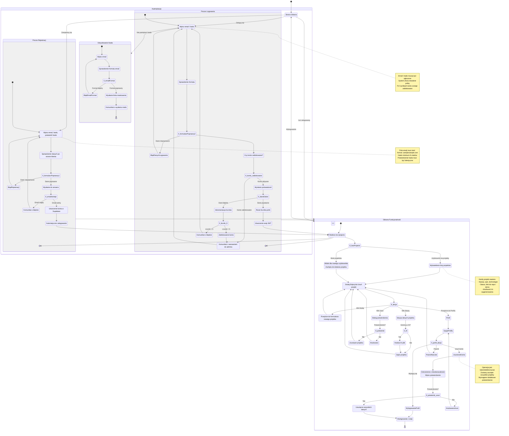

# Diagram Podróży Użytkownika - Moduł Autentykacji i Portfolio

```mermaid
stateDiagram-v2

[*] --> StranaGlowna

state "Strona Główna" as StranaGlowna

state Autentykacja {
  StranaGlowna --> FormulaRejestracji: Zarejestruj się
  StranaGlowna --> FormulaLogowania: Zaloguj się

  state "Proces Rejestracji" as Rejestracja {
    [*] --> FormulaRejestracji
    FormulaRejestracji: Wpisz email, hasło, potwierdź hasło
    FormulaRejestracji --> WalidacjaRejestracji
    WalidacjaRejestracji: Sprawdzenie danych po stronie klienta
    WalidacjaRejestracji --> if_formularzPoprawny1 <<choice>>
    if_formularzPoprawny1 --> BlądRejestracji: Dane niepoprawne
    BlądRejestracji --> FormulaRejestracji
    if_formularzPoprawny1 --> WysłanieRejestracji: Dane poprawne
    WysłanieRejestracji: Wysłanie do serwera
    WysłanieRejestracji --> if_emailIstnieje <<choice>>
    if_emailIstnieje --> BlądEmail: Email zajęty
    BlądEmail: Komunikat o błędzie
    BlądEmail --> FormulaRejestracji
    if_emailIstnieje --> UtworzKonto: Email wolny
    UtworzKonto: Utworzenie konta w Supabase
    UtworzKonto --> AutoLoginRejestracja
    AutoLoginRejestracja: Automatyczne zalogowanie
    AutoLoginRejestracja --> PrzekierowanieNaListe
    PrzekierowanieNaListe --> [*]
  }

  state "Proces Logowania" as Logowanie {
    [*] --> FormulaLogowania
    FormulaLogowania: Wpisz email i hasło
    FormulaLogowania --> WalidacjaLogowania
    WalidacjaLogowania: Sprawdzenie formatu
    WalidacjaLogowania --> if_formularzPoprawny2 <<choice>>
    if_formularzPoprawny2 --> BlądDanychLogowania: Dane niepoprawne
    BlądDanychLogowania --> FormulaLogowania
    if_formularzPoprawny2 --> SprawdzenieBlokady
    SprawdzenieBlokady: Czy konto zablokowane?
    SprawdzenieBlokady --> if_konto_zablokowane <<choice>>
    if_konto_zablokowane --> KontoZablokowane: Konto zablokowane
    KontoZablokowane: Komunikat z wezwaniem do admina
    KontoZablokowane --> FormulaLogowania
    if_konto_zablokowane --> WysłanieLogowania: Konto aktywne
    WysłanieLogowania: Wysłanie poświadczeń
    WysłanieLogowania --> if_daneDobre <<choice>>
    if_daneDobre --> BlądLogowania: Dane błędne
    BlądLogowania: Inkrementacja licznika
    BlądLogowania --> if_licznik_5 <<choice>>
    if_licznik_5 --> AutoBlokada: Licznik = 5
    AutoBlokada: Zablokowanie konta
    AutoBlokada --> KontoZablokowane
    if_licznik_5 --> BlądLogowania2: Licznik < 5
    BlądLogowania2: Komunikat o błędzie
    BlądLogowania2 --> FormulaLogowania
    if_daneDobre --> ResetLicznika: Dane poprawne
    ResetLicznika: Reset licznika prób
    ResetLicznika --> UtworzSesje
    UtworzSesje: Utworzenie sesji JWT
    UtworzSesje --> PrzekierowanieNaListe
    PrzekierowanieNaListe --> [*]
  }

  state "Odzyskiwanie Hasła" as OdzyskiwanieHasla {
    [*] --> FormulaOdzyskiwania
    FormulaOdzyskiwania: Wpisz email
    FormulaOdzyskiwania --> WalidacjaEmailu
    WalidacjaEmailu: Sprawdzenie formatu email
    WalidacjaEmailu --> if_emailFormat <<choice>>
    if_emailFormat --> BlądEmailFormat: Format błędny
    BlądEmailFormat --> FormulaOdzyskiwania
    if_emailFormat --> WysłanieMailaReset: Format poprawny
    WysłanieMailaReset: Wysłanie linka resetowania
    WysłanieMailaReset --> KomunikatWysłania
    KomunikatWysłania: Komunikat o wysłaniu maila
    KomunikatWysłania --> [*]
  }
}

FormulaLogowania --> OdzyskiwanieHasla: Nie pamiętam hasła

state "Główna Funkcjonalność" as Funkcjonalnosc {
  [*] --> PrzekierowanieNaListe
  PrzekierowanieNaListe: Redirect do /projects
  PrzekierowanieNaListe --> if_hasProjects <<choice>>
  if_hasProjects --> ListaProjektów: Użytkownik ma projekty
  if_hasProjects --> EmptyState: Brak projektów

  ListaProjektów: Wyświetlenie listy projektów
  ListaProjektów --> WidokProjektow

  EmptyState: Widok dla nowego użytkownika
  EmptyState: Zachęta do dodania projektu
  EmptyState --> WidokProjektow

  WidokProjektow: Dodaj Edytuj lub Usuń projekt
  WidokProjektow --> if_akcja <<choice>>

  if_akcja --> DodawanieProj: Klik Dodaj
  DodawanieProj: Przejście do formularza nowego projektu
  DodawanieProj --> WidokProjektow

  if_akcja --> EdycjaProj: Klik Edytuj
  EdycjaProj: Edycja danych projektu
  EdycjaProj --> if_AI: Generuj z AI?
  if_AI --> AIOpcja: Tak
  if_AI --> BezAI: Nie
  AIOpcja: Analiza AI plik
  AIOpcja --> BezAI
  BezAI: Zapis projektu
  BezAI --> WidokProjektow

  if_akcja --> UsuniecieProj: Klik Usuń
  UsuniecieProj: Dialog potwierdzenia
  UsuniecieProj --> if_potwierdz: Potwierdzenie?
  if_potwierdz --> Potwierdzone: Tak
  if_potwierdz --> Anulowano: Nie
  Potwierdzone: Usunięcie projektu
  Potwierdzone --> WidokProjektow
  Anulowano --> WidokProjektow

  if_akcja --> Profil: Przejście do Profilu
  Profil --> OpujeProfilu
  OpujeProfilu --> if_profil_akcja <<choice>>

  if_profil_akcja --> WylogowanieProfil: Wyloguj się
  if_profil_akcja --> UsuniecieKonta: Usuń konto
  if_profil_akcja --> PowrotNaListe: Powrót

  WylogowanieProfil --> Wylogowanie
  UsuniecieKonta --> DialogPotwierdzenia
  PowrotNaListe --> WidokProjektow

  DialogPotwierdzenia: Ostrzeżenie o nieodwracalności
  DialogPotwierdzenia: Wpisz potwierdzenie
  DialogPotwierdzenia --> if_potwierdz_usun: Potwierdzenie?
  if_potwierdz_usun --> Potwierdzone_Usun: Tak
  if_potwierdz_usun --> AnulowanoUsun: Nie
  Potwierdzone_Usun: Usunięcie wszystkich danych
  Potwierdzone_Usun --> Wylogowanie
  AnulowanoUsun --> OpujeProfilu

  Wylogowanie: Wylogowanie z sesji
  Wylogowanie --> [*]
}

Rejestracja --> Funkcjonalnosc
Logowanie --> Funkcjonalnosc
StranaGlowna --> Funkcjonalnosc: Już zalogowany

Funkcjonalnosc --> StranaGlowna: Wylogowanie

note right of FormulaRejestracji
  Pole email musi mieć format: user@example.com
  Hasło minimum 8 znaków
  Potwierdzenie hasła musi być identyczne
end note

note right of FormulaLogowania
  Email i hasło muszą być zgłoszone
  System zlicza nieudane próby
  Po 5 próbach konto zostaje zablokowane
end note

note right of ListaProjektów
  Każdy projekt zawiera:
  - Nazwę, opis, technologie
  - Status, linki do repo i demo
  - Możliwość AI-wygenerowania
end note

note right of UsuniecieKonta
  Operacja jest NIEODWRACALNA
  Zostaną usunięte wszystkie projekty
  Wymagane dodatkowe potwierdzenie
end note
```
