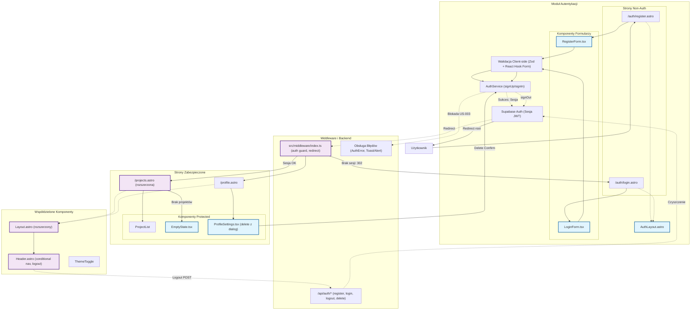

<architecture_analysis>

1. Komponenty wymienione w plikach referencyjnych:
   - Z PRD.md: Formularz rejestracji (US-001), formularz logowania (US-002), mechanizm blokady konta (US-003), opcja usunięcia konta (US-004), lista projektów (US-007), empty state dla nowych użytkowników (US-005), strona profilu (3.4).
   - Z auth-spec.md: Strony Astro: /auth/register.astro, /auth/login.astro, /projects.astro (rozszerzona), /profile.astro; Komponenty React: RegisterForm.tsx, LoginForm.tsx, ProfileSettings.tsx, EmptyState.tsx, ProjectList (zakładany); Layouty: Layout.astro (rozszerzony o isAuthenticated), AuthLayout.astro, Header.astro (rozszerzony o conditional nav i logout); Middleware: src/middleware/index.ts; Serwisy: AuthService (src/lib/auth.service.ts), supabase-server (src/lib/supabase-server.ts); Endpointy API: /api/auth/register, /api/auth/login, /api/auth/logout, /api/auth/account, /api/auth/session; Modele: User type (rozszerzony), user_profiles tabela.

2. Główne strony i ich odpowiadające komponenty:
   - /auth/register.astro (non-auth): RegisterForm.tsx (w slocie).
   - /auth/login.astro (non-auth): LoginForm.tsx (w slocie), z AuthLayout.astro.
   - /projects.astro (auth-protected): ProjectList, EmptyState.tsx, z Layout.astro i Header.astro.
   - /profile.astro (auth-protected): ProfileSettings.tsx, z Layout.astro i Header.astro.
   - Layouty: AuthLayout dla auth pages; Layout dla protected, z Header (conditional).

3. Przepływ danych między komponentami:
   - Użytkownik wchodzi na stronę non-auth -> Form (Register/Login) -> Walidacja client-side (Zod + React Hook Form) -> AuthService -> Supabase Auth (signUp/signIn) -> Sesja (JWT) -> Middleware sprawdza sesję -> Redirect do /projects jeśli sukces.
   - Na protected pages: Middleware -> getSession -> Jeśli brak sesji, redirect /auth/login -> Render strony z komponentami (np. ProfileSettings -> Dialog confirm -> AuthService.deleteUser -> signOut -> Redirect root).
   - Header: Server-side getSession -> Conditional render nav -> Logout: POST /api/auth/logout -> Czyszczenie sesji.
   - Przepływ błędów: Walidacja -> Toast/Alert -> Early return.

4. Krótki opis funkcjonalności każdego komponentu:
   - RegisterForm.tsx: Obsługuje formularz rejestracji (email, password, confirm), walidacja, integracja z AuthService.signUp, auto-login i nawigacja po sukcesie.
   - LoginForm.tsx: Formularz logowania (email, password), check blokady, integracja z AuthService.signIn, licznik prób, redirect po sukcesie.
   - ProfileSettings.tsx: Komponent ustawień profilu z przyciskiem usuwania konta; dialog z potwierdzeniem (input 'usuń', ostrzeżenie), wywołuje AuthService.deleteUser, signOut, redirect.
   - EmptyState.tsx: Wyświetla zachętę dla nowych użytkowników bez projektów, CTA do dodania projektu.
   - Header.astro: Topbar z conditional nawigacją (auth: Projekty, Dodaj, Profil, Wyloguj; non-auth: Zaloguj, Zarejestruj), integracja z ThemeToggle, ARIA accessibility.
   - Middleware (index.ts): Auth guard – pobiera sesję Supabase, ustawia locals.user, redirect do /auth/login dla protected routów bez sesji.
   - AuthService: Abstrakcja nad Supabase Auth – metody signUp, signIn, signOut, deleteUser (admin), z error handling.
   - Layout.astro: Główny layout z prop isAuthenticated, renderuje Header, obsługuje stany auth/non-auth.
   - AuthLayout.astro: Uproszczony layout dla stron auth, bez dostępu do portfolio.
   - Endpointy API: Obsługują CRUD auth (register, login, logout, delete), walidacja Zod, RLS, error mapping.

</architecture_analysis>

<mermaid_diagram>

</mermaid_diagram>
